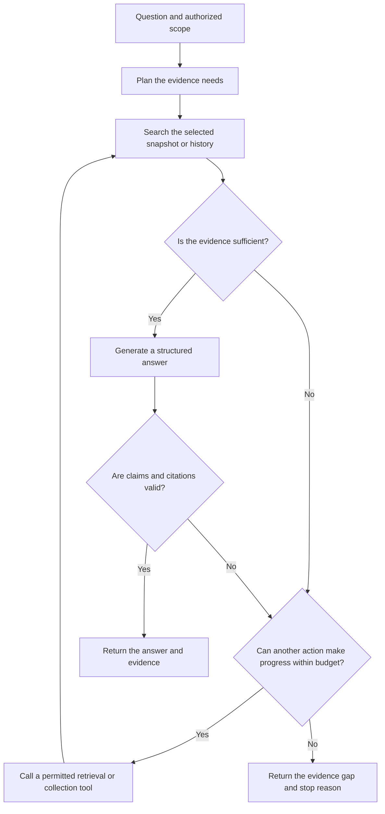

# GitMind future scope

Status: proposed roadmap. The features below are not claims of completed implementation.

## Purpose and scope

GitMind helps users understand current code and the recorded reasons for code changes. Future work must improve evidence quality, reliability, usability, and measurable performance.

This document includes the seven proposed additions and an eighth addition for agentic retrieval-augmented generation (RAG). Each feature has a delivery scope, integration points, and acceptance criteria.

The roadmap extends [gitmind_prd.md](gitmind_prd.md), [docs/INGESTION_DESIGN.md](docs/INGESTION_DESIGN.md), and [docs/IMPLEMENTATION_PLAN.md](docs/IMPLEMENTATION_PLAN.md). Those documents remain the baseline for ingestion and core pipeline acceptance. Job-description research is a motivation for this roadmap, not evidence that these additions guarantee employment or production readiness.

Use selective current-code ingestion as the target default. Collect historical evidence when the question requires it. Keep full-history ingestion as an explicit background mode with limits. An agent must not bypass those limits.

## Foundation required before expansion

Complete and verify the applicable foundation work before adding dependent features:

- Pin a code snapshot. Preserve repository identity, commit, path, line range, and source type in its metadata.
- Use deterministic chunk identities and safe index-generation replacement. Reload all readers together after an update.
- Apply repository, access, module, and time constraints across vector search, keyword search, full-text search, and graph expansion.
- Keep embedding provider, model, version, and dimensions consistent between indexing and querying. Reject invalid vectors.
- Execute planned subquestions where needed. Distinguish current-code evidence from historical evidence.
- Maintain typed, evidenced graph links. A mention or chronological sequence alone does not establish causality.
- Return explicit provider and readiness failures. Do not return a successful empty answer after all providers fail.
- Track which sources entered the final context. Separate retrieved sources from cited evidence.
- Extract a shared query service for the API, CLI, evaluation runner, and later MCP integration.

Some foundation work already exists or is underway. Determine completion from acceptance evidence in the implementation plan, not from the presence of a module.

## Roadmap overview

| Item | Addition | Main outcome | Initial dependency |
|---|---|---|---|
| 1 | LLM observability and tracing | Explain pipeline behavior, failures, latency, and cost | Stable stage boundaries and request IDs |
| 2 | Evaluation-gated CI/CD | Detect regressions and publish reproducible comparisons | Correct retrieval, usable evaluation data |
| 3 | MCP server | Make repository evidence available to coding assistants | Shared query service and access controls |
| 4 | Bounded multi-hop retrieval | Find related evidence across commits, PRs, and issues | Typed links, consistent filters, subquestion execution |
| 5 | Guardrails and security | Protect repository data and validate answer evidence | Source provenance and repository isolation |
| 6 | Feedback and live quality review | Convert observed failures into reviewed regression cases | Trace IDs, evidence snapshots, retention controls |
| 7 | Streaming, caching, and model routing | Improve response time and control resource use | Measured baseline and compatible provider behavior |
| 8 | Agentic RAG orchestration | Adapt the full workflow to evidence needs within fixed limits | Items 1, 2, 4, and 5 |

## 1. LLM observability and tracing

### Objective

Make each answer inspectable from request entry to response delivery. Show where time and resources were spent and why a request failed.

### Detailed scope

- Assign a request ID and trace ID. Propagate them through the API, shared query service, tool calls, and background collection jobs.
- Create spans for planning, entity resolution, query embedding, each retrieval branch, rank fusion, graph expansion, reranking, context assembly, and generation.
- Record repository, snapshot/index generation, provider/model, prompt version, stage duration, retries, result counts, and outcome.
- Record actual token usage when a provider supplies it. Mark calculated values as estimates. Version pricing assumptions and identify local inference separately.
- Capture provider outages, fallback use, invalid vectors, missing indices, coverage gaps, and budget stops.
- Expose operational metrics through `/metrics`. Report request/error counts, latency distributions, provider failures, and queue depth. Avoid high-cardinality source IDs in metric labels.
- Use one tracing backend initially. OpenTelemetry or Langfuse are candidates. Do not build parallel telemetry stacks without a demonstrated need.
- Keep full source text and prompts out of telemetry by default. Add explicit redaction and retention settings for diagnostic capture.

### Integration points

`api/main.py`, the shared query service, `retrieval/`, `embedding/`, `generation/llm_client.py`, and ingestion orchestration.

### Acceptance criteria

- One request produces a connected trace for all executed stages.
- Failed and fallback requests produce visible outcomes without exposing credentials.
- A reproducible workload reports latency percentiles, token usage, and cost estimates with their assumptions.
- Tracing failures do not prevent normal query handling. Measure instrumentation overhead.

## 2. Evaluation-gated CI/CD

### Objective

Demonstrate that a change preserves correctness and improves the intended capability. Make benchmark results reproducible.

### Detailed scope

- Create a human-reviewed dataset from pinned repository snapshots and linked history. Store expected facts, source IDs, dates, answerability, and coverage assumptions.
- Include current-code, decision-history, ownership, temporal, multi-hop, contradictory-evidence, and unsupported questions.
- Use separate development and held-out sets. Synthetic questions can propose candidates, but a reviewer must approve the reference answers and evidence paths.
- Correct the RAGAS adapter for the pinned dependency version. Configure the judge and embedding provider explicitly.
- Replace misleading accuracy claims from simple word/year overlap with checks against labeled facts and paths. Keep useful heuristics clearly labeled as diagnostics.
- Integrate MLflow into the evaluation runner. Log dataset/index versions, provider/model, prompt, retrieval parameters, metrics, and reports.
- Compare vector-only, hybrid, hybrid plus reranker, graph expansion, and bounded adaptive retrieval on the same data.
- Add GitHub Actions for tests and deterministic evidence/filter checks on each PR. Run paid or variable model-judge evaluations on a schedule or controlled trigger.
- Define gates from measured baselines and tolerated variation. Version thresholds. Publish comparison artifacts and an optional PR summary with minimal permissions.

### Integration points

`evaluation/`, `tests/`, the shared query service, a reviewed dataset directory, and `.github/workflows/`.

### Acceptance criteria

- A clean checkout can run deterministic checks without paid API credentials.
- A deliberate filter or citation regression fails CI.
- Incorrect dates, unsupported entities, and unrelated document paths reduce the applicable quality scores.
- A benchmark report includes all configurations, sample counts, limitations, latency, and resource use. Model-judge gates account for observed score variance.

## 3. MCP server

### Objective

Let compatible coding assistants query GitMind without duplicating its retrieval and generation logic.

### Detailed scope

- Add an MCP adapter over the shared query service. Start with a local transport and read-only tools.
- Proposed tools include `search_repository`, `explain_decision`, `decision_memo`, `blame_map`, and `repository_coverage`.
- Require an explicit repository and supported snapshot or history scope. Define typed inputs and structured outputs with source locations and coverage limits.
- Return source references, evidence IDs, and answer status. Do not expose raw credentials or arbitrary filesystem access.
- Add cancellation, request limits, and clear errors for missing data or failed providers.
- Document setup for supported clients and provide one tested client integration.
- Add remote transport only with an appropriate authentication and repository authorization design. Do not forward client tokens to unrelated services.
- Keep ingestion and repository modification outside the initial tool set.

### Integration points

Proposed `interface/mcp_server.py`, existing generation modes, repository metadata, and the shared query service.

### Acceptance criteria

- A supported client completes a real repository query and receives usable citations.
- Equivalent API, CLI, and MCP requests enforce the same constraints.
- Invalid arguments, unauthorized repositories, cancellation, and provider failures return explicit errors.

## 4. Bounded multi-hop retrieval

### Objective

Reconstruct supported evidence paths when a single search cannot explain a change.

### Detailed scope

- Execute relevant subquestions from the query plan. Merge and deduplicate their results within the request budget.
- Add focused operations to search commits, inspect diffs, walk typed graph links, and read linked PRs or issues.
- Preserve relation type, direction, repository, timestamps, and the source that supports each link.
- Follow relevant paths such as commit to PR to motivating issue. Preserve contradictory evidence and missing links.
- Apply access and query constraints to every result. An explicit historical comparison may use separately labeled time scopes.
- Define evidence sufficiency from the required facts and sources. Do not rely only on an LLM's self-reported confidence.
- Allow a limited additional search when evidence is incomplete. Stop on sufficient evidence, no new evidence, cancellation, or a budget limit.
- Add limits for graph depth, searches, retrieved documents, transfer bytes, tokens, elapsed time, and cost.
- Return an insufficient-evidence status when the required path cannot be established.

### Integration points

`retrieval/query_decomposer.py`, `retrieval/graph_walker.py`, `entities/temporal_graph.py`, `ingestion/cross_referencer.py`, and bounded history collection.

### Acceptance criteria

- A known-answer case returns the expected linked sources and correct chronology.
- Unrelated mentions do not count as a causal explanation.
- Every expansion enforces repository/access boundaries and declared time semantics.
- Tests prove each stop condition. Benchmarks compare quality and cost with the fixed pipeline.

## 5. Guardrails and security

### Objective

Treat repository content as untrusted data and ensure that users receive supported answers within their access scope.

### Detailed scope

- Separate trusted instructions from retrieved content. Mark PR bodies, issues, comments, and code as evidence, not instructions.
- Limit tool capabilities and validate arguments. Prompt-injection controls reduce risk but cannot guarantee prevention.
- Exclude secret files before content transfer. Redact likely credentials and configured sensitive fields before indexing or telemetry storage.
- Preserve source identifiers and useful locations after redaction. Record that content was removed without recording its value.
- Authenticate API requests and enforce repository authorization throughout retrieval, tools, caches, feedback, and exports.
- Add per-key request limits, payload limits, collection budgets, and controlled outbound repository fetching.
- Use structured answer schemas. Validate cited source IDs, final-context membership, source locations, and supported factual claims.
- Distinguish invalid citations, insufficient evidence, incomplete history, and provider failures in the response.
- Add adversarial tests for malicious instructions, secret exposure, fabricated citations, cross-repository access, and unsupported conclusions.

### Integration points

Ingestion selection/sanitization, parsing, API middleware, tool validation, `generation/`, prompt templates, and context assembly.

### Acceptance criteria

- Seeded secrets do not enter indices, telemetry, or output.
- Unauthorized sources cannot appear through any search, graph, cache, or tool path.
- Nonexistent or excluded-context citations fail validation.
- Adversarial fixtures cannot trigger unauthorized tool actions. Report residual limitations.

## 6. Feedback and live quality review

### Objective

Turn observed user failures into actionable improvements and reviewed evaluation cases.

### Detailed scope

- Add thumbs up/down, wrong-citation, and missing-evidence feedback in Streamlit.
- Add an authenticated `/feedback` endpoint. Tie feedback to the query/trace ID, answer, cited sources, repository, index generation, model, and prompt version.
- Store optional comments with appropriate redaction, access controls, and retention. Support deletion where required by the deployment policy.
- Sample eligible requests for background quality review after response delivery. Bound judge cost and make external processing configurable.
- Judge support for claims, source relevance, time consistency, and appropriate abstention. Treat judge results as fallible review signals.
- Group recurring failures for review. Human reviewers approve corrected answers and sources before adding cases to the regression set.
- Avoid automatic training or publishing of private repository content from feedback.

### Integration points

`interface/streamlit_app.py`, `api/`, a feedback store, tracing, and `evaluation/dataset_builder.py`.

### Acceptance criteria

- Feedback resolves to the exact answer and evidence version the user saw.
- A reviewed failure becomes a reproducible regression case.
- Background review cannot delay or fail the original request.
- Unauthorized users cannot read another repository's feedback or source content.

## 7. Streaming, caching, and cost-aware model routing

### Objective

Improve responsiveness and resource efficiency while preserving evidence correctness.

### Detailed scope

- Add server-sent events for stage progress and generation. Support cancellation and explicit completion/error events.
- Distinguish provisional text from the final validated answer. Do not present unchecked streamed claims as verified evidence.
- Start with an exact response cache. Include repository, access scope, snapshot/index generation, filters, answer mode, prompt version, and model policy in cache identity.
- Invalidate incompatible entries after data, permissions, prompts, or provider policies change.
- Consider semantic caching only after measuring false matches. Different dates, modules, and repository versions must not reuse an incorrect answer.
- Route requests using measured quality, latency, context needs, and cost. Keep unsupported questions eligible for abstention.
- Define provider timeouts, retry budgets, circuit breakers, and total request limits. Add providers only when benchmark evidence justifies them.
- Keep answer-generation fallback separate from embedding compatibility. A fallback embedding model may require a separate compatible index.
- Show measured usage and clearly labeled cost estimates. Measure cold-start and warm-request performance separately.

### Integration points

`generation/llm_client.py`, the query service, API streaming routes, Streamlit, caching, and telemetry.

### Acceptance criteria

- Streaming handles success, disconnects, cancellation, validation failure, and total provider outage.
- Cache isolation and invalidation tests cover repositories, permissions, versions, and time filters.
- Routing meets predeclared quality constraints while reporting cost and latency changes.
- Failed generation and invalid evidence are not cached as successful answers.

## 8. Agentic RAG orchestration

### Objective

Use a bounded controller to select retrieval actions, collect missing evidence, and validate an answer before returning it.

Item 4 supplies multi-hop retrieval operations. This item coordinates the full request workflow around those operations. Both items share one implementation and evidence store. Do not create two competing agent systems.

### Detailed scope

- Route questions into current-code explanation, historical decision, ownership, or risk workflows. Keep a direct route for questions that already have sufficient evidence.
- Maintain typed state containing repository/access scope, question plan, selected snapshot, evidence, coverage, index generation, tool results, and remaining budgets.
- Provide narrow tools for current-code search, hybrid history search, source inspection, linked-record retrieval, graph traversal, and bounded history collection.
- Let the controller select its next action from missing evidence. Validate every tool call against the request scope and remaining budget.
- Keep current-code and historical sources separate. Pin newly collected evidence to its source version and record when the request's evidence set changes.
- Detect duplicate actions and repeated results. Stop on no progress, sufficient evidence, cancellation, provider failure, or budget exhaustion.
- Generate a structured answer only after evidence collection. Validate citations and claims before final delivery.
- Return explicit outcomes such as answered, insufficient evidence, collection incomplete, budget exhausted, or provider failure.
- Trace decisions and tool outcomes as concise operational summaries. Do not require storage or display of private model reasoning.
- Keep repository writes, arbitrary commands, and deployment actions outside the agent's capabilities.
- Consider LangGraph for state, transitions, checkpoints, and interrupts. A small custom state machine is also acceptable. Select the framework based on implementation needs and benchmark evidence.

### Proposed control flow

The same budget covers retrieval and validation retries. Resuming a workflow must not reset consumed limits or repeat external actions without checking their recorded results.

### Example

A user asks why the authentication module changed from sessions to JWT. The controller searches the relevant code and history, reads the introducing commit, follows its PR link, and reads the linked issue. It returns only reasons supported by those records. If the motivating discussion is unavailable, it reports that gap instead of inventing a rationale.

### Integration points

Proposed `orchestration/` or a focused extension of `retrieval/`, the shared query service, item 4 tools, selective history collection, answer validators, tracing, and evaluation.

### Acceptance criteria

- Known-answer cases produce the required evidence paths. Unsupported cases stop without fabricated explanations.
- Every tool enforces repository, access, source-version, and resource limits.
- Tests cover repeated actions, no progress, contradictory evidence, interrupted execution, and budget stops.
- A held-out comparison measures quality, abstention, tool calls, latency, and cost against the fixed pipeline and item 4 alone.
- Enable the adaptive route only for question classes where measured benefit justifies its overhead. Keep the validated direct workflow available.

## Delivery order

1. Complete applicable foundation acceptance checks and establish a reproducible baseline.
2. Deliver evaluation and CI, followed by tracing. Instrument early enough to diagnose benchmark failures.
3. Deliver evidence validation and repository security before exposing new tools or live feedback data.
4. Add MCP over the shared service and demonstrate one real client integration.
5. Add bounded multi-hop retrieval, then the agentic controller. Evaluate each increment separately.
6. Add user feedback and reviewed regression-case promotion.
7. Optimize with streaming and exact caching. Add semantic caching, model routing, and live judges only after measurement.

## Portfolio completion evidence

- Publish a benchmark with pinned data, configurations, expected sources, limitations, quality scores, latency percentiles, and cost assumptions.
- Demonstrate one current-code question, one commit-PR-issue explanation, and one unsupported question.
- Show a trace and a checked evidence chain for the history question.
- Demonstrate a failed regression gate, a provider outage, and a repository-access rejection.
- Provide clean setup instructions, dependency versions, a deployment verification record, and supported MCP client configuration.
- Document implemented, experimental, and planned capabilities separately. Update architecture diagrams when features pass their acceptance checks.

## Technical references

- [OpenTelemetry semantic conventions](https://opentelemetry.io/docs/specs/semconv/)
- [Model Context Protocol documentation](https://modelcontextprotocol.io/docs/getting-started/intro)
- [Model Context Protocol security best practices](https://modelcontextprotocol.io/specification/latest/basic/security_best_practices)
- [LangGraph overview](https://docs.langchain.com/oss/python/langgraph/overview)

These references inform future implementation. Pin and verify compatible versions when a feature is built.
